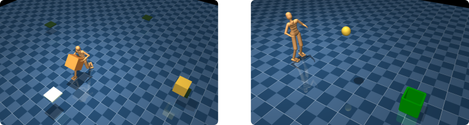

# Catch & Carry: Reusable Neural Controllers for Vision-Guided Whole-Body Tasks

This package contains motion capture data and tasks associated with "Catch &
Carry: Reusable Neural Controllers for Vision-Guided Whole-Body Tasks"
(https://arxiv.org/abs/1911.06636), which was published at SIGGRAPH 2020.
This is research code, and has dependencies on more stable code that is
available as part of [`dm_control`], in particular upon components in
[`dm_control.locomotion`].

To get access to preconfigured python environments for the "warehouse" and "ball
toss" tasks, see the `task_examples.py` file. To use the MuJoCo interactive
viewer (from dm_control) to load the environments, see `explore.py`.

<p float="left">
  
</p>

## Installation instructions

1.  Download [MuJoCo Pro](https://mujoco.org/) and extract the zip archive as
    `~/.mujoco/mujoco200_$PLATFORM` where `$PLATFORM` is one of `linux`,
    `macos`, or `win64`.

2.  Ensure that a valid MuJoCo license key file is located at
    `~/.mujoco/mjkey.txt`.

3.  Clone the `deepmind-research` repository:

    ```shell
       git clone https://github.com/deepmind/deepmind-research.git
       cd deepmind-research
    ```

4.  Create and activate a Python virtual environment:

    ```shell
       python3 -m virtualenv catch_carry
       source catch_carry/bin/activate
    ```

5.  Install the package:

    ```shell
       pip install ./catch_carry
    ```

## Quickstart

To instantiate and step through the warehouse task:

```python
from catch_carry import task_examples
import numpy as np

# Build an example environment.
env = task_examples.build_vision_warehouse()

# Get the `action_spec` describing the control inputs.
action_spec = env.action_spec()

# Step through the environment for one episode with random actions.
time_step = env.reset()
while not time_step.last():
  action = np.random.uniform(action_spec.minimum, action_spec.maximum,
                             size=action_spec.shape)
  time_step = env.step(action)
  print("reward = {}, discount = {}, observations = {}.".format(
      time_step.reward, time_step.discount, time_step.observation))
```

The above code snippet can also be used for the ball toss task by replacing
`build_vision_warehouse` with `build_vision_toss`.

## Visualization

[`dm_control.viewer`] can be used to visualize and interact with the
environment. We provide the `explore.py` script specifically for this. If you
followed our installation instructions above, this can be launched for the
warehouse task via:

```shell
python3 -m catch_carry.explore --task=warehouse
```

and for the ball toss task via:

```shell
python3 -m catch_carry.explore --task=toss
```

## Citation

If you use the code or data in this package, please cite:

```
@article{merel2020catch,
    title = {Catch \& Carry: Reusable Neural Controllers for
             Vision-Guided Whole-Body Tasks},
    author = {Merel, Josh and
              Tunyasuvunakool, Saran and
              Ahuja, Arun and
              Tassa, Yuval and
              Hasenclever, Leonard and
              Pham, Vu and
              Erez, Tom and
              Wayne, Greg and
              Heess, Nicolas},
    journal = {ACM Trans. Graph.},
    issue_date = {July 2020},
    publisher = {Association for Computing Machinery},
    address = {New York, NY, USA},
    volume = {39},
    number = {4},
    articleno = {39},
    numpages = {14},
    issn = {0730-0301},
    year = {2020},
    month = jul,
    url = {https://doi.org/10.1145/3386569.3392474},
    doi = {10.1145/3386569.3392474},
}
```

[`dm_control`]: https://github.com/deepmind/dm_control
[`dm_control.locomotion`]: https://github.com/deepmind/dm_control/tree/master/dm_control/locomotion
[`dm_control.viewer`]: https://github.com/deepmind/dm_control/tree/master/dm_control/viewer
