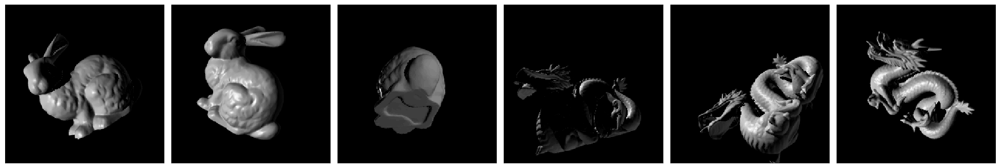

# Geometric Manifold Component Estimator (GEOMANCER)

This package provides an implementation of the Geometric Manifold Component
Estimator, or GEOMANCER, as described in [Disentangling by Subspace Diffusion
(2020)](https://arxiv.org/abs/2006.12982), as well as information about the
[Stanford 3D Objects for Disentangling (S3O4D) dataset](https://console.cloud.google.com/storage/browser/dm_s3o4d).
GEOMANCER is a nonparametric algorithm for disentangling, somewhat similar in
spirit to Laplacian Eigenmaps or Vector Diffusion Maps, except instead of
producing an embedding for the data, it produces a set of subspaces around each
data point, one subspace for each disentangled factor of variation in the data.
This differs from more common algorithms for disentangling that originated in
the deep learning community, such as the beta-VAE, TCVAE or FactorVAE, which
learn a nonlinear embedding and probabilistic generative model of the data.
GEOMANCER is intended for data where the individual factors of variation might
be more than one dimensional, for instance 3D rotations. At the moment,
GEOMANCER works best when some ground truth information about the metric in the
data space is available, for instance knowledge of the "true" nearest neighbors
around each point, and we do not recommend running GEOMANCER directly on
unstructured data from high-dimensional spaces. We are providing the code here
to enable the interested researcher to get some hands-on experience with the
ideas around differential geometry, holonomy and higher-order graph connection
Laplacians we explore in the paper.


## Installation

To install the package locally in a new virtual environment run:
```bash
python3 -m venv geomancer
source geomancer/bin/activate
git clone https://github.com/deepmind/deepmind-research.git .
cd deepmind-research/geomancer
pip install -e .
```

## Example

To run, simply load or generate an array of data, and call the `fit` function:

```
import numpy as np
import geomancer

# Generate data from a product of two spheres
data = []
for i in range(2):
  foo = np.random.randn(1000, 3)
  data.append(foo / np.linalg.norm(foo, axis=1, keepdims=True))
data = np.concatenate(data, axis=1)

# Run GEOMANCER. The underlying manifold is 4-dimensional.
components, spectrum = geomancer.fit(data, 4)
```

If ground truth information about the tangent spaces is available in a space
that is aligned with the data, then the performance can be evaluated using the
`eval_aligned` function. If ground truth data is only available in an unaligned
space, for instance if the embedding used to generate the data is not the same
as the space in which the data is observed, then the `eval_unaligned` function
can be used, which requires both the data and disentangled tangent vectors in
the ground truth space. Examples of both evaluation metrics are given in the
demo in `train.py`.


## Demo on Synthetic Manifolds

The file `train.py` runs GEOMANCER on a product of manifolds that can be
specified by the user. The number of data points to train on is given by the
`--npts` flag, while the specification of the manifold is given by the
`--specification` flag. The `--rotate` flag specifies whether a random rotation
should be applied to the data. If false, `eval_aligned` will be used to evaluate
the result. If true, `eval_unaligned` will be used to evaluate the result.

For instance, to run on the product of the sphere in 2 and 4 dimensions and the
special orthogonal group in 3 dimensions, run:

```
python3 train.py --specification='S^2','S^4','SO(3)' --npts=100000
```

This passes a list of strings as the manifold specification flag. Note that a
manifold this large will require a large amount of data to work and may require
hours or days to run. The default example should run in just a few minutes.

The demo plots 3 different outputs:
1. The eigenvalue spectrum of the 2nd-order graph Laplacian. This should have
a large gap in the spectrum at the eigenvalue equal to the number of
submanifolds.
2. The basis vectors for each disentangled subspace around one point.
3. The ground truth basis vectors for the disentangled subspaces at the same
point. If `--rotate=False`, and GEOMANCER has sufficient data, each basis matrix
should span the same subspace as the results in the second plot.

## Stanford 3D Objects for Disentangling (S3O4D)



The data used in the "Stanford 3D Objects" section of the experimental results
is available in [TensorFlow Datasets](https://www.tensorflow.org/datasets/catalog/s3o4d).
The data consists of 100,000 renderings each of the Bunny and Dragon objects
from the [Stanford 3D Scanning Repository](http://graphics.stanford.edu/data/3Dscanrep/).
More objects may be added in the future, but only the Bunny and Dragon are used
in the paper. Each object is rendered with a uniformly sampled illumination from
a point on the 2-sphere, and a uniformly sampled 3D rotation. The true latent
states are provided as NumPy arrays along with the images. The lighting is given
as a 3-vector with unit norm, while the rotation is provided both as a
quaternion and a 3x3 orthogonal matrix.

### Why another dataset?

There are many similarities between S3O4D and existing ML benchmark datasets
like [NORB](https://cs.nyu.edu/~ylclab/data/norb-v1.0/),
[3D Chairs](https://github.com/mathieuaubry/seeing3Dchairs),
[3D Shapes](https://github.com/deepmind/3d-shapes) and many others, which also
include renderings of a set of objects under different pose and illumination
conditions. However, none of these existing datasets include the *full manifold*
of rotations in 3D - most include only a subset of changes to elevation and
azimuth. S3O4D images are sampled uniformly and independently from the full
space of rotations and illuminations, meaning the dataset contains objects that
are upside down and illuminated from behind or underneath. We believe that this
makes S3O4D uniquely suited for research on generative models where the latent
space has non-trivial topology, as well as for general manifold learning
methods where the curvature of the manifold is important.

### Usage

To load from TensorFlow Datasets, simply run:

```
import tensorflow_datasets as tfds

ds = tfds.load('s3o4d', split='bunny_train', shuffle_files=True)
for example in ds.take(1):
  image, label, illumination, pose_mat, pose_quat = (
      example['image'], example['label'], example['illumination'],
      example['pose_mat'], example['pose_quat'])
```

where the split can be any of `bunny_train`, `dragon_train`, `bunny_test` or
`dragon_test`.

If you prefer to not have TensorFlow as a dependency for your project, and want
to download the data manually, you can find the raw data (as zipped JPEGs and
NumPy arrays) on [Google Cloud](https://console.cloud.google.com/storage/browser/dm_s3o4d).
To load the data for a given object, unzip `images.zip` into a folder called
`images` in the same directory as `latents.npz`, and from inside that
directory run:

```
import numpy as np
from PIL import Image

with open('latents.npz', 'r') as f:
  data = np.load(f)
  illumination = data['illumination']  # lighting source position, a 3-vector
  pose_quat = data['pose_quat']  # object pose (3D rotation as a quaternion)
  pose_mat = data['pose_mat']  # object pose (3D rotation as a matrix)

def get_data(i):
  """Return data and latent given an index up to 100,000."""
  img = np.array(Image.open(f'images/{i:05}.jpg'))
  # Uses the matrix, not quaternion, representation,
  # similarly to the experiments in the paper
  latent = np.concatenate((illumination[i],
                           pose_mat[i].reshape(-1)))
  return img, latent

img, latent = get_data(0)
```

To do the same train/test split as in TensorFlow Datasets, simply use the first
80,000 images for each object as training data and the last 20,000 as test.

## Giving Credit

If you use this code or the Stanford 3D Objects for Disentangling data in your
work, we ask you to cite this paper:

```
@article{pfau2020disentangling,
  title={Disentangling by Subspace Diffusion},
  author={Pfau, David and Higgins, Irina and Botev, Aleksandar and Racani\`ere,
  S{\'e}bastian},
  journal={Advances in Neural Information Processing Systems (NeurIPS)},
  year={2020}
}
```

## Disclaimer

This is not an official Google product.
