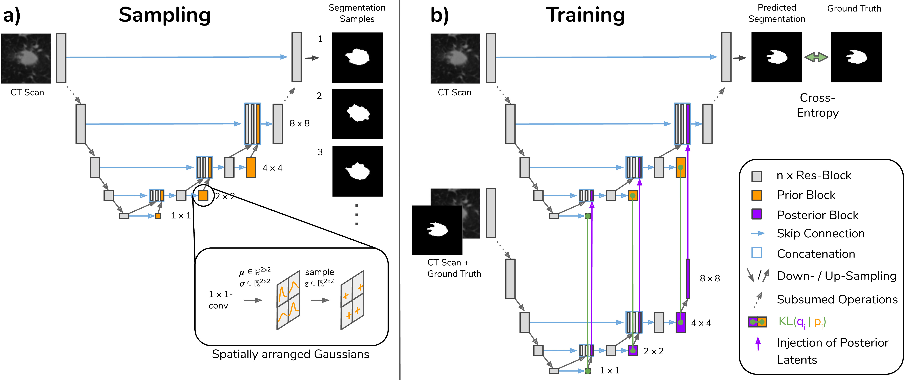

# Hierarchical Probabilistic U-Net



This package provides an implementation of the Hierarchical Probabilistic U-Net
(HPU-Net) as published in [A Hierarchical Probabilistic U-Net for Modeling
Multi-Scale Ambiguities (2019)](https://arxiv.org/abs/1905.13077).

The HPU-Net combines a hierarchical VAE with a U-Net and learns an
image-conditional distribution over plausible outputs, here segmentation maps.
The hierarchical latent space decomposition allows to model independent
variations across locations and scales and increases the granularity of
predicted segmentations as compared to prior work ([the Probabilisitc
U-Net](https://arxiv.org/abs/1806.05034)).
The architecture, depicted above, interleaves the U-Net's decoder with a
prior that is used when sampling at test time (see Subfigure a) above). Training
proceeds as is typical for VAEs, i.e. a separate posterior network is employed
whose latents are injected into the decoder (see Subfigure b) above).

The animated gif below shows 16 segmentation samples when sampling from either
a) the full hierarchy or fixing some of the latents to the prior's mean: b)
fixing all but the most local latents and c) fixing all but the most global
latent.  The first row depicts CT scans showing potential lung abnormalities and
the rows below show individual samples and the standard deviations cross them.


In addition to the model code we provide the preprocessed version of the
[LIDC-IDRI
dataset](https://wiki.cancerimagingarchive.net/display/Public/LIDC-IDRI)
that we employ as well as pretrained model weights. Both can be loaded in a
public colab, see below.

## Colab [](https://colab.research.google.com/github/deepmind/deepmind-research/blob/master/hierarchical_probabilistic_unet/HPU_Net.ipynb)
To quickly tinker with the pretrained model and the dataset without the need of
installing anything locally click the `Open in Colab`-button above to follow the
link to the colab.


## Installation
To install the package locally run:
```bash
git clone https://github.com/deepmind/deepmind-research.git .
cd deepmind-research/hierarchical_probabilistic_unet
pip install -e .
```

## LIDC 2D crops
We provide a preprocessed version of the Lung Image Database Consortium image
collection dataset
([LIDC-IDRI](https://wiki.cancerimagingarchive.net/display/Public/LIDC-IDRI))
as used and described in [A Hierarchical Probabilistic U-Net for Modeling
Multi-Scale Ambiguities (2019)](https://arxiv.org/abs/1905.13077).

The original dataset consists of 3D lung CT scans with semantic segmentations of
possible lung abnormalities, as graded by four expert readers. We have cleaned
up the data resulting in a slightly changed number of images for
each data set split, see below (which leaves the results the same). The data is
hosted in Google Cloud Storage ([this bucket](https://console.cloud.google.com/storage/browser/hpunet-data/lidc_crops/)).

#####Preprocessing:

We resampled the CT scans to 0.5mm x 0.5mm in-plane resolution and then cropped
2D images of size 180 x 180 pixels, centered on the abnormality position. The
abnormality positions are those where at least one of the experts segmented an
abnormality and we assumed that two masks from different graders correspond to
the same abnormality if their tightest bounding boxes overlap. We only used
those abnormaliies that were specified as a polygon (outline) in the XML files
of the LIDC dataset, disregarding the ones that only have center of shape. That
is, according to the LIDC paper we use the ones that are larger than 3mm, and
filter out the others, that are clinically less relevant ([2], see below).
We also filterd out each Dicom file whose absolute value in the XML element of
`SliceLocation` differs from the absolute value of the last element in
`ImagePositionPatient`.

This preprocessing results in 8843 images for training, 1993 for validation and
1980 for testing (corresponding to 530, 111 and 103 patients respectively).

#####Directory Structure

The GCS bucket contains tar.gz-files for the training, validation and test data.
Each tar.gz-file contains a zipped directory with two subdirectories, one named
`images` and `gt`. Their subdirectories comprise a directory for each patient
that is part of that data split. Each patient's directory holds the
corresponding cropped 2D images in .png-format. The naming scheme follows
`z-<imageZposition>_c<crop number of the slice>.png` for CT scans and
`z-<imageZposition>_c<crop number of the slice>_l<labeller id in [1,4]>.png` for
the binary segmentation maps, allowing to match the images and their
corresponding four annotations.


#####Citations & Data Usage Policy:

The [LIDC-IDRI
dataset](https://wiki.cancerimagingarchive.net/display/Public/LIDC-IDRI)
was published in [1, 2, 3] and is made available under the [CC BY 3.0
license](https://creativecommons.org/licenses/by/3.0/).

[1] Armato III, Samuel G., McLennan, Geoffrey, Bidaut, Luc, McNitt-Gray, Michael
F., Meyer, Charles R., Reeves, Anthony P., … Clarke, Laurence P. (2015). Data
From LIDC-IDRI. The Cancer Imaging Archive.
([Link](http://doi.org/10.7937/K9/TCIA.2015.LO9QL9SX))

[2] Armato SG III, McLennan G, Bidaut L, McNitt-Gray MF, Meyer CR, Reeves AP,
Zhao B, Aberle DR, Henschke CI, Hoffman EA, Kazerooni EA, MacMahon H, van Beek
EJR, Yankelevitz D, et al.:  The Lung Image Database Consortium (LIDC) and Image
Database Resource Initiative (IDRI): A completed reference database of lung
nodules on CT scans. Medical Physics, 38: 915--931, 2011.
([Paper](https://www.ncbi.nlm.nih.gov/pubmed/21452728))

[3] Clark K, Vendt B, Smith K, Freymann J, Kirby J, Koppel P, Moore S, Phillips
S, Maffitt D, Pringle M, Tarbox L, Prior F. The Cancer Imaging Archive (TCIA):
Maintaining and Operating a Public Information Repository, Journal of Digital
Imaging, Volume 26, Number 6, December, 2013, pp 1045-1057.
([Paper](https://link.springer.com/article/10.1007%2Fs10278-013-9622-7))

We make the `LIDC 2D crops` data, accessible from above GCS bucket, available
under the [CC BY 3.0 license](https://creativecommons.org/licenses/by/3.0/).


## Pretrained Model
We provide a pretrained model checkpoint ([Google Cloud Storage
bucket](https://console.cloud.google.com/storage/browser/hpunet-data/model_checkpoint/))
that can be loaded as exemplified in our colab.


## Giving Credit

If you use this code in your work, we ask you to cite this paper:

```
@article{kohl2019hierarchical,
  title={A Hierarchical Probabilistic U-Net for Modeling Multi-Scale Ambiguities},
  author={Kohl, Simon AA and Romera-Paredes, Bernardino and Maier-Hein, Klaus H and Rezende, Danilo Jimenez and Eslami, SM and Kohli, Pushmeet and Zisserman, Andrew and Ronneberger, Olaf},
  journal={arXiv preprint arXiv:1905.13077},
  year={2019}
}
```

## Disclaimer

This is not an official Google product.
