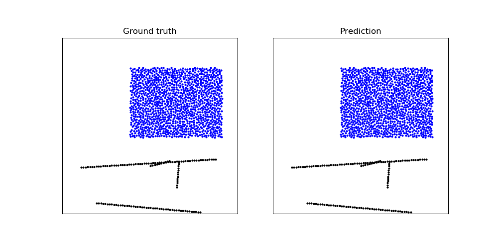

# Learning to Simulate Complex Physics with Graph Networks (ICML 2020)

ICML poster: [icml.cc/virtual/2020/poster/6849](https://icml.cc/virtual/2020/poster/6849)

Video site: [sites.google.com/view/learning-to-simulate](https://sites.google.com/view/learning-to-simulate)

ArXiv: [arxiv.org/abs/2002.09405](https://arxiv.org/abs/2002.09405)

If you use the code here please cite this paper:

    @inproceedings{sanchezgonzalez2020learning,
      title={Learning to Simulate Complex Physics with Graph Networks},
      author={Alvaro Sanchez-Gonzalez and
              Jonathan Godwin and
              Tobias Pfaff and
              Rex Ying and
              Jure Leskovec and
              Peter W. Battaglia},
      booktitle={International Conference on Machine Learning},
      year={2020}
    }

## Example usage: train a model and display a trajectory

After downloading the repo, and from the parent directory. Install dependencies:

    pip install -r learning_to_simulate/requirements.txt
    mkdir -p /tmp/rollous

Download dataset (e.g. WaterRamps):

    mkdir -p /tmp/datasets
    bash ./learning_to_simulate/download_dataset.sh WaterRamps /tmp/datasets

Train a model:

    mkdir -p /tmp/models
    python -m learning_to_simulate.train \
        --data_path=/tmp/datasets/WaterRamps \
        --model_path=/tmp/models/WaterRamps

Generate some trajectory rollouts on the test set:

    mkdir -p /tmp/rollouts
    python -m learning_to_simulate.train \
        --mode="eval_rollout" \
        --data_path=/tmp/datasets/WaterRamps \
        --model_path=/tmp/models/WaterRamps \
        --output_path=/tmp/rollouts/WaterRamps

Plot a trajectory:

    python -m learning_to_simulate.render_rollout \
        --rollout_path=/tmp/rollouts/WaterRamps/rollout_test_0.pkl

## Datasets

Datasets are available to download via:

* Metadata file with dataset information (sequence length, dimensionality, box bounds, default connectivity radius, statistics for normalization, ...):

  `https://storage.googleapis.com/learning-to-simulate-complex-physics/Datasets/{DATASET_NAME}/metadata.json`

* TFRecords containing data for all trajectories (particle types, positions, global context, ...):

  `https://storage.googleapis.com/learning-to-simulate-complex-physics/Datasets/{DATASET_NAME}/{DATASET_SPLIT}.tfrecord`

Where:

* `{DATASET_SPLIT}` is one of:
  * `train`
  * `valid`
  * `test`

* `{DATASET_NAME}` one of the datasets following the naming used in the paper:
  * `WaterDrop`
  * `Water`
  * `Sand`
  * `Goop`
  * `MultiMaterial`
  * `RandomFloor`
  * `WaterRamps`
  * `SandRamps`
  * `FluidShake`
  * `FluidShakeBox`
  * `Continuous`
  * `WaterDrop-XL`
  * `Water-3D`
  * `Sand-3D`
  * `Goop-3D`

The provided script `./download_dataset.sh` may be used to download all files from each dataset into a folder given its name.

An additional smaller dataset `WaterDropSample`, which includes only the first two trajectories of `WaterDrop` for each split, is provided for debugging purposes.

## Code structure

* `train.py`: Script for training, evaluating and generating rollout trajectories.
* `learned_simulator.py`: Implementation of the learnable one-step model that returns the next position of the particles given inputs. It includes data preprocessing, Euler integration, and a helper method for building normalized training outputs and targets.
* `graph_network.py`: Implementation of the graph network used at the core of the learnable part of the model.
* `render_rollout.py`: Visualization code for displaying rollouts such as the example animation.
* `{noise/connectivity/reading}_utils.py`: Util modules for adding noise to the inputs, computing graph connectivity and reading datasets form TFRecords.
*  `model_demo.py`: example connecting the model to input dummy data.

Note this is a reference implementation not designed to scale up to TPUs (unlike the one used for the paper). We have tested that the model can be trained with a batch size of 2 on a single NVIDIA V100 to reach similar qualitative performance (except for the XL and 3D datasets due to OOM).
