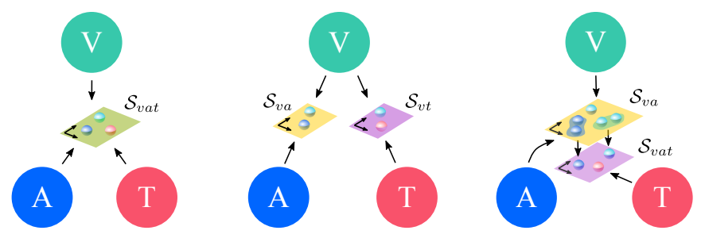

# Self-supervised Multimodal Versatile Networks

This is the code for the models in MMV - https://arxiv.org/abs/2006.16228.



We also make available the code for linear evaluation of a pre-trained model
in UCF101 and the JAX checkpoints for our best models.

We use different parameters for video compression in UCF101 than the ones
used in `tensorflow_datasets`. We provide the code to download and
preprocess the dataset. The eval_ucf101.py script reproduces the results we
report in Table 2 of the paper, using the checkpoints provided below.

Visual Backbone  | Training Dataset | Results on Linear UCF101
------- | -------- | --------
S3D-G | AudioSet + HowTo | 89.6
Resnet TSM-50 | AudioSet + HowTo | 91.5
Resnet TSM-50 (x2) | AudioSet + HowTo | 91.8


## Setup

To set up a Python virtual environment with the required dependencies, run:

```shell
python3 -m venv mmv_env
source mmv_env/bin/activate
pip install --upgrade pip setuptools wheel
pip install -r mmv/requirements.txt --use-feature=2020-resolver
```


### Linear evaluation

The linear evaluation on UCF101 can be run using:

```shell
python -m mmv.eval_ucf101 \
  --checkpoint_path=</path/to/the/checkpointing/folder> \
  --dataset_folder=</path/to/dataset/folder>
```

## Checkpoints

We provide three checkpoints containing the best pre-trained weights for each
of the visual backbones we use in the paper, i. e., S3D-G, Resnet-50 TSM,
and Resnet-50 TSM x 2.

- [S3D-G](https://storage.googleapis.com/deepmind-research-mmv/mmv_s3d.pkl)
- [Resnet-50 TSM](https://storage.googleapis.com/deepmind-research-mmv/mmv_tsm_resnet_x1.pkl)
- [Resnet-50 TSMx2](https://storage.googleapis.com/deepmind-research-mmv/mmv_tsm_resnet_x2.pkl)

## References

### Citing our work

If you use that code for your research, please consider citing our paper:

```bibtex
@inproceedings{alayrac2020self,
  title={{S}elf-{S}upervised {M}ulti{M}odal {V}ersatile {N}etworks},
  author={Alayrac, Jean-Baptiste and Recasens, Adri{\`a} and Schneider, Rosalia and Arandjelovi{\'c}, Relja and Ramapuram, Jason and De Fauw, Jeffrey and Smaira, Lucas and Dieleman, Sander and Zisserman, Andrew},
  booktitle={NeurIPS},
  year={2020}
}
```

### Models in TF

You may also be interested in using our TF-Hub release models available at:

- [S3D-G](https://tfhub.dev/deepmind/mmv/s3d/1)
- [Resnet-50 TSM](https://tfhub.dev/deepmind/mmv/tsm-resnet50/1)
- [Resnet-50 TSMx2](https://tfhub.dev/deepmind/mmv/tsm-resnet50x2/1)

## License

While the code is licensed under the Apache 2.0 License, the checkpoints weights
are made available for non-commercial use only under the terms of the
Creative Commons Attribution-NonCommercial 4.0 International (CC BY-NC 4.0)
license. You can find details at:
https://creativecommons.org/licenses/by-nc/4.0/legalcode.
