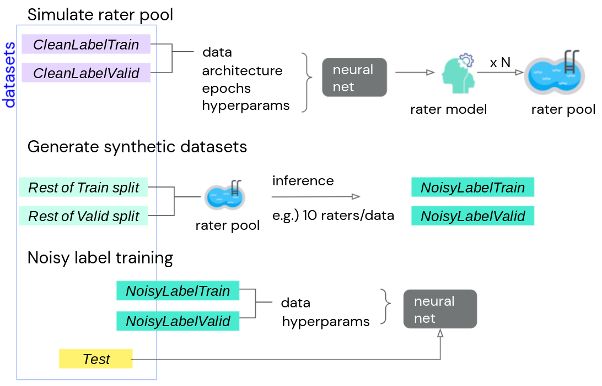

# A Realistic Simulation Framework for Learning with Label Noise

We propose a simulation framework for generating realistic instance-dependent
noisy labels via a pseudo-labeling paradigm. We show that this framework
generates synthetic noisy labels that exhibit important characteristics of the
label noise in practical settings. Equipped with controllable label noise, we
study the negative impact of noisy labels across a few realistic settings to
understand when label noise is more problematic. Additionally, with the
availability of annotator information from our simulation framework, we propose
a new technique, Label Quality Model (LQM), that leverages annotator features to
predict and correct against noisy labels. We show that by adding LQM as a label
correction step before applying existing noisy label techniques, we can further
improve the models' performance.

[A Realistic Simulation Framework for Learning with Label Noise](https://arxiv.org/pdf/2107.11413.pdf).

In this repository, we provide the link to the datasets that we used in Sections
4 and 5 of the above paper, along with a colab that demonstrates how to load the
data and rater features.
We consider 4 tasks:
[CIFAR10](https://www.cs.toronto.edu/~kriz/cifar.html),
[CIFAR100](https://www.cs.toronto.edu/~kriz/cifar.html),
[Patch Camelyon](https://patchcamelyon.grand-challenge.org/),
and
[Cats vs Dogs](https://www.microsoft.com/en-us/download/details.aspx?id=54765).
For each task, we generate three synthetic noisy label
datasets, named as "low", "medium", and "high" according to the amount of label
noise. The data are stored as TFRecords and the rater features are stored as
json files.

The data is available under
[noisy label synthetic dataset GCP bucket](https://console.cloud.google.com/storage/browser/noisy_label_synthetic_datasets).

The colab that contains details of the datasets and examples for data loading
is at
[this colab example](https://github.com/deepmind/deepmind-research/blob/master/noisy_label/noisy_label_datasets_and_rater_features.ipynb)

## License
The noisy labels and rater features in our datasets are under the
[CC0 License](https://choosealicense.com/licenses/cc0-1.0/).
Other parts of the datasets are under the original license of the datasets.

When using the datasets based on CIFAR10/CIFAR100, users are required to
attribute the following paper:

Learning Multiple Layers of Features from Tiny Images, Alex Krizhevsky, 2009

When using the datasets based on Patch Camelyon, users are required to
attribute the following paper:

Rotation Equivariant CNNs for Digital Pathology, Bastiaan S. Veeling,
Jasper Linmans, Jim Winkens, Taco Cohen, and Max Welling, arXiv:1806.03962.

When using the datasets based on Cats vs Dogs, users are required to
attribute the following paper:

Asirra: a CAPTCHA that exploits interest-aligned manual image categorization,
Jeremy Elson, John R. Douceur, Jon Howell, and Jared Saul, ACM Conference on
Computer and Communications Security, 2007.

The colab example is provided under the Apache License, Version 2.0.


## Citation

Please use the following bibtex for citations to our paper:

```
@article{gu2021realistic,
  title={A Realistic Simulation Framework for Learning with Label Noise},
  author={Gu, Keren and Masotto, Xander and Bachani, Vandana and Lakshminarayanan, Balaji and Nikodem, Jack and Yin, Dong},
  year={2021}
}
```

# Dataset Metadata

The following table is necessary for this dataset to be indexed by search
engines such as <a href="https://g.co/datasetsearch">Google Dataset Search</a>.
<div itemscope itemtype="http://schema.org/Dataset">
<table>
  <tr>
    <th>property</th>
    <th>value</th>
  </tr>
  <tr>
    <td>name</td>
    <td><code itemprop="name">Noisy Label Synthetic Datasets</code></td>
  </tr>
  <tr>
    <td>url</td>
    <td><code itemprop="url">https://github.com/deepmind/deepmind-research/tree/master/noisy_label</code></td>
  </tr>
  <tr>
    <td>sameAs</td>
    <td><code itemprop="sameAs">https://github.com/deepmind/deepmind-research/tree/master/noisy_label</code></td>
  </tr>
  <tr>
    <td>description</td>
    <td><code itemprop="description">
      Data accompanying
[A Realistic Simulation Framework for Learning with Label Noise]().
      </code></td>
  </tr>
  <tr>
    <td>provider</td>
    <td>
      <div itemscope itemtype="http://schema.org/Organization" itemprop="provider">
        <table>
          <tr>
            <th>property</th>
            <th>value</th>
          </tr>
          <tr>
            <td>name</td>
            <td><code itemprop="name">DeepMind</code></td>
          </tr>
          <tr>
            <td>sameAs</td>
            <td><code itemprop="sameAs">https://en.wikipedia.org/wiki/DeepMind</code></td>
          </tr>
        </table>
      </div>
    </td>
  </tr>
  <tr>
    <td>citation</td>
    <td><code itemprop="citation">https://identifiers.org/arxiv:2107.11413</code></td>
  </tr>
</table>
</div>
