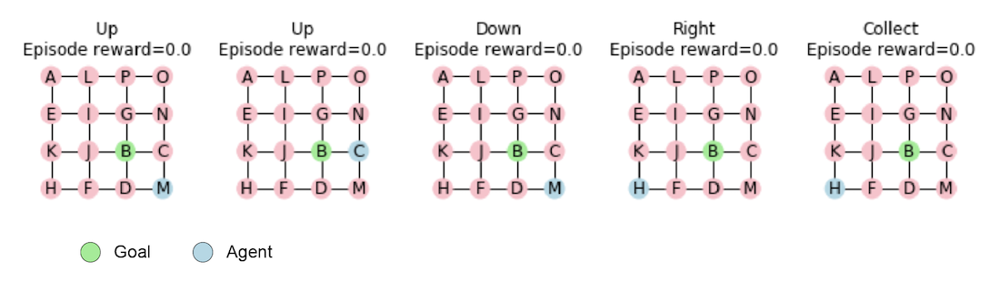
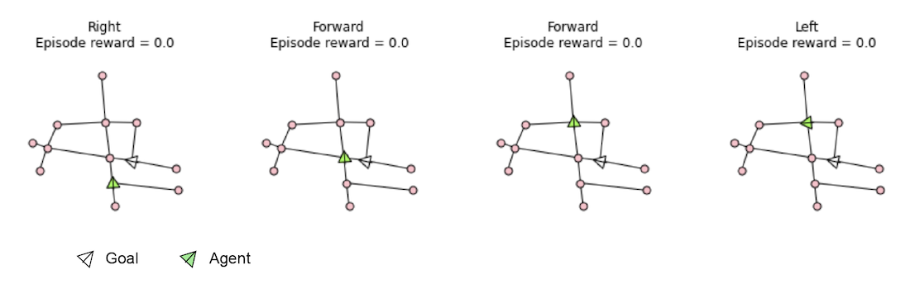

# One-shot StreetLearn and Memory & Planning Game

This repository contains code for the environments used in the paper
["Rapid Task-Solving in Novel Environments"](https://arxiv.org/abs/2006.03662)
by Sam Ritter, Ryan Faulkner, Laurent Sartran, Adam Santoro, Matt Botvinick and
David Raposo. It was published as a conference paper at ICLR 2021.

To cite this work:

```
@inproceedings{
  ritter2021rapid,
  title={Rapid Task-Solving in Novel Environments},
  author={Samuel Ritter and Ryan Faulkner and Laurent Sartran and Adam Santoro
  and Matthew Botvinick and David Raposo},
  booktitle={International Conference on Learning Representations},
  year={2021},
  url={https://openreview.net/forum?id=F-mvpFpn_0q}
}
```

### Memory&Planning Game

The _Memory&Planning Game_ is a simple variation of the well-known _Memory
Game_, wherein players must remember the locations of cards in a grid. This
variation extends the challenge to require planning as well as remembering.

In the _Memory&Planning Game_, the agent occupies an environment consisting
of a grid of symbols (e.g. 4x4). The observation consists of two symbols — one
which corresponds to the agent's current location, and another that corresponds
to the "goal" the agent is tasked with navigating to. The agent can not see its
relative location with respect to other symbols in the grid. At each step the
agent selects one of 5 possible actions: _move left_, _move right_, _move up_,
_move down_, and _collect_. If the agent chooses the "collect" action when its
current location symbol matches the goal symbol, a reward of +1 is received.
Otherwise, the agent receives a reward of 0. At the beginning of each episode, a
new set of symbols is sampled, effectively inducing a new transition function.
The agent is allowed a fixed number of steps (e.g. 100) per episode to "collect"
as many goals as possible. Each time the agent collects a goal — which
corresponds to completing a task —, a new goal is sampled in and the transition
function stays fixed.

#### Example

The following code snipped shows an example of how to load the environment,
start a new episode and take a few random steps. A plot representing the current
state of the environment is displayed for each step.

```
import memory_planning_game

env = memory_planning_game.MemoryPlanningGame(4, seed=123)
_ = env.reset()
for _ in range(5):
  timestep = env.take_random_action()
  fig, ax = env.draw_maze()
```



### One-Shot StreetLearn

The _One-Shot StreetLearn_ is a domain wherein environments are sampled as
neighborhoods from the _StreetLearn_ dataset (Mirowski et al., 2019). Tasks are
then sampled by selecting a position and orientation that the agent must
navigate to from its current location.

In _One-Shot StreetLearn_, the agent's observations consist of a representation
of the current state and a representation of the goal state. The agent receives
no other information from the environment. The available actions are _turn
right_, which orients the agent clockwise toward the next available direction of
motion from its current location; _turn left_, which does the same in the other
direction; and _move forward_, which moves the agent along the direction it is
facing to the next available location. In each episode, we sample a new
neighborhood with 5 intersections from one of 12 cities. To reduce the
exploration problem while keeping the planning difficulty constant, we removed
all the locations that were not intersections (i.e. that corresponded to
degree-2 nodes in the connectivity graph of the sampled neighbourhood).

Note: In the paper we used images to represent each location, taken from the
_StreetLearn_ dataset. In this codebase, to simplify the public release process,
we replace the images with one-hot vectors, to represent each location.

Every time the agent reaches a goal, a new starting- and goal-state pair is
sampled, initiating a new task, until the fixed episode step limit is reached
(e.g. 200 steps). A step that takes the agent to the goal state results in a
reward of +1. Any other step results in a reward of 0.

#### City graph datasets

In this [link]
(https://console.cloud.google.com/storage/browser/one_shot_streetlearn_graphs)
you can download the datasets containing the connectivity graphs of different
cities. You will need at least one of these datasets in order to build the
environment.

#### Example

The following code snipped shows an example of how to load the environment for
an example city (in this case, Madrid), start a new episode and take a few
random steps. A plot representing the current state of the environment is
displayed for each step.

```
import numpy as np
import one_shot_streetlearn

region = 'madrid'
sl_config = {
    'dataset_path': f'./datasets/{region}_full_graph.gexf',
    'max_episode_steps': 200,
    'num_junctions': 5,
}
env = one_shot_streetlearn.OneShotStreetLearn(**sl_config)

_ = env.reset()
for _ in range(4):
  rnd_action = np.random.randint(env.NUM_ACTIONS)
  timestep = env.step(rnd_action)
  fig, ax = env.draw_subgraph()
```


