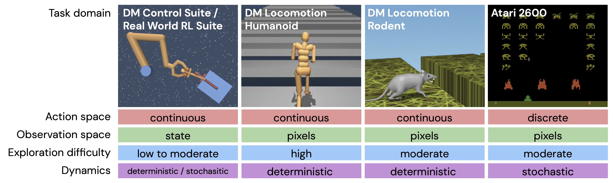

# RL Unplugged: Benchmarks for Offline Reinforcement Learning

RL Unplugged is suite of benchmarks for offline reinforcement learning. The RL
Unplugged is designed around the following considerations: to facilitate ease of
use, we provide the datasets with a unified API which makes it easy for the
practitioner to work with all data in the suite once a general pipeline has been
established. This is a dataset accompanying the paper
[RL Unplugged: Benchmarks for Offline Reinforcement Learning]([https://arxiv.org/abs/2006.13888]).

In this suite of benchmarks, we try to focus on the following problems:

-   High dimensional action spaces, for example the locomotion humanoid domains,
    we have 56 dimensional actions.

-   High dimensional observations.

-   Partial observability, observations have egocentric vision.

-   Difficulty of exploration, using states of the art algorithms and imitation
    to generate data for difficult environments.

-   Real world challenges.

The data is available under
[RL Unplugged GCP bucket](https://console.cloud.google.com/storage/browser/rl_unplugged).

## Atari Dataset

We are releasing a large and diverse dataset of gameplay following the protocol
described by [Agarwal et al., 2020], which can be used to evaluate several
discrete offline RL algorithms. The dataset is generated by running an online
DQN agent and recording transitions from its replay during training with sticky
actions [Machado et al., 2018]. As stated in [Agarwal et al., 2020], for each
game we use data from five runs with 50 million transitions each. States in each
transition include stacks of four frames to be able to do frame-stacking with
our baselines. We release datasets for 46 Atari games. For details on how the
dataset was generated, please refer to the paper.

Atari is a standard RL benchmark. We recommend you to try offline RL methods
on Atari if you are interested in comparing your approach to other state of the
art offline RL methods with discrete actions.


## DeepMind Locomotion Dataset

These tasks are made up of the corridor locomotion tasks involving the CMU
Humanoid, for which prior efforts have either used motion capture data [Merel et
al., 2019a], [Merel et al., 2019b] or training from scratch [Song et al., 2020].
In addition, the DM Locomotion repository contains a set of tasks adapted to be
suited to a virtual rodent [Merel et al., 2020]. We emphasize that the DM
Locomotion tasks feature the combination of challenging high-DoF continuous
control along with perception from rich egocentric observations. For details on
how the dataset was generated, please refer to the paper.

We recommend you to try offline RL methods on DeepMind Locomotion dataset, if
you are interested in very challenging offline RL dataset with continuous
action space.

## DeepMind Control Suite Dataset

DeepMind Control Suite [Tassa et al., 2018] is a set of control tasks
implemented in MuJoCo [Todorov et al., 2012]. We consider a subset of the tasks
provided in the suite that cover a wide range of difficulties.

Most of the datasets in this domain are generated using D4PG. For the
environments Manipulator insert ball and Manipulator insert peg we use V-MPO
[Song et al., 2020] to generate the data as D4PG is unable to solve these tasks.
We release datasets for 9 control suite tasks. For details on how the dataset
was generated, please refer to the paper.

DeepMind Control Suite is a traditional continuous action RL benchmark. In
particular, we recommend you test your approach in DeepMind Control Suite if
you are interested in comparing against other state of the art offline RL
methods.

## Realworld RL Dataset

Examples in the dataset represent SARS transitions stored when running a
partially online trained agent as described in
[RWRL](https://arxiv.org/abs/2003.11881).

We release 8 datasets in total -- with no combined challenge and easy combined
challenge on the cartpole, walker, quadruped, and humanoid tasks. For details on
how the dataset was generated, please refer to the paper.

## DeepMind Lab Dataset

DeepMind Lab dataset has several levels from the challenging, partially
observable [Deepmind Lab suite](https://github.com/deepmind/lab). DeepMind Lab
dataset is collected by training distributed R2D2 by [Kapturowski et al., 2018]
agents from scratch on individual tasks. We recorded the experience across all
actors during entire training runs a few times for every task. The details of
the dataset generation process is described in [Gulcehre et al., 2021].

We release datasets for five different DeepMind Lab levels: `seekavoid_arena_01`,
`explore_rewards_few`, `explore_rewards_many`, `rooms_watermaze`,
`rooms_select_nonmatching_object`. We also release the snapshot datasets for
`seekavoid_arena_01` level that we generated the datasets from a trained R2D2
snapshot with different levels of epsilons for the epsilon-greedy algorithm
when evaluating the agent in the environment.

DeepMind Lab dataset is fairly large-scale. We recommend you to try it if you
are interested in large-scale offline RL models with memory.

## bsuite Dataset

[bsuite](https://github.com/deepmind/bsuite) data was collected by training DQN
agents with the default setting in [Acme](https://github.com/deepmind/acme) from
scratch in each one of the following three tasks: cartpole, catch, and
mountain_car.

We converted the originally deterministic environments into stochastic ones by
randomly replacing the agent action with a uniformly sampled action with a
probability  of {0, 0.1, 0.2, 0.3, 0.4, 0.5}. In this case, probability of 0
corresponds to original environment.  The details of
the dataset generation process is described in [Gulcehre et al., 2021].

bsuite datasets are fairly light-weight and running experiments doesn't require
too much compute. We recommend you to try bsuite, if you are interested in
small-scale and easy to run offline RL datasets generated by stochastic
environments where the stochasticity of the environment is easy to control.

## Running the code

### Installation

* Install dependencies: `pip install -r requirements.txt`
* (Optional) Setup MuJoCo license key for DM Control environments
([instructions](https://github.com/deepmind/dm_control#requirements-and-installation)).
* (Optional) Install
[realworldrl_suite](https://github.com/google-research/realworldrl_suite#installation).

### Atari example

```
mkdir -p /tmp/dataset/Asterix
gsutil cp gs://rl_unplugged/atari/Asterix/run_1-00000-of-00100 \
    /tmp/dataset/Asterix/run_1-00000-of-00001
python atari_example.py --path=/tmp/dataset --game=Asterix
```

This copies a single shard from one of the Asterix datasets from GCP to a local
folder, and then runs a script that loads a single example and runs a step on
the Atari environment.

## Citation

Please use the following bibtex for citations:

```
@misc{gulcehre2020rl,
    title={RL Unplugged: Benchmarks for Offline Reinforcement Learning},
    author={Caglar Gulcehre and Ziyu Wang and Alexander Novikov and Tom Le Paine
        and  Sergio Gómez Colmenarejo and Konrad Zolna and Rishabh Agarwal and
        Josh Merel and Daniel Mankowitz and Cosmin Paduraru and Gabriel
        Dulac-Arnold and Jerry Li and Mohammad Norouzi and Matt Hoffman and
        Ofir Nachum and George Tucker and Nicolas Heess and Nando deFreitas},
    year={2020},
    eprint={2006.13888},
    archivePrefix={arXiv},
    primaryClass={cs.LG}
}
```

# Dataset Metadata

The following table is necessary for this dataset to be indexed by search
engines such as <a href="https://g.co/datasetsearch">Google Dataset Search</a>.
<div itemscope itemtype="http://schema.org/Dataset">
<table>
  <tr>
    <th>property</th>
    <th>value</th>
  </tr>
  <tr>
    <td>name</td>
    <td><code itemprop="name">RL Unplugged</code></td>
  </tr>
  <tr>
    <td>url</td>
    <td><code itemprop="url">https://github.com/deepmind/deepmind-research/tree/master/rl_unplugged</code></td>
  </tr>
  <tr>
    <td>sameAs</td>
    <td><code itemprop="sameAs">https://github.com/deepmind/deepmind-research/tree/master/rl_unplugged</code></td>
  </tr>
  <tr>
    <td>description</td>
    <td><code itemprop="description">
      Data accompanying
[RL Unplugged: Benchmarks for Offline Reinforcement Learning]().
      </code></td>
  </tr>
  <tr>
    <td>provider</td>
    <td>
      <div itemscope itemtype="http://schema.org/Organization" itemprop="provider">
        <table>
          <tr>
            <th>property</th>
            <th>value</th>
          </tr>
          <tr>
            <td>name</td>
            <td><code itemprop="name">DeepMind</code></td>
          </tr>
          <tr>
            <td>sameAs</td>
            <td><code itemprop="sameAs">https://en.wikipedia.org/wiki/DeepMind</code></td>
          </tr>
        </table>
      </div>
    </td>
  </tr>
  <tr>
    <td>citation</td>
    <td><code itemprop="citation">https://identifiers.org/arxiv:2006.13888</code></td>
  </tr>
</table>
</div>

[Agarwal et al., 2020]: https://arxiv.org/abs/1907.04543
[Machado et al., 2018]: https://arxiv.org/abs/1709.06009
[Merel et al., 2019a]: https://arxiv.org/abs/1811.09656
[Merel et al., 2019b]: https://arxiv.org/abs/1811.11711
[Merel et al., 2020]: https://arxiv.org/abs/1911.09451
[Song et al., 2020]: https://arxiv.org/abs/1909.12238
[Tassa et al., 2018]: https://arxiv.org/abs/1801.00690
[Todorov et al., 2012]: https://homes.cs.washington.edu/~todorov/papers/TodorovIROS12.pdf
[Kapturowski et al., 2018]: https://openreview.net/forum?id=r1lyTjAqYX
[Gulcehre et al., 2021]: https://arxiv.org/abs/2103.09575
